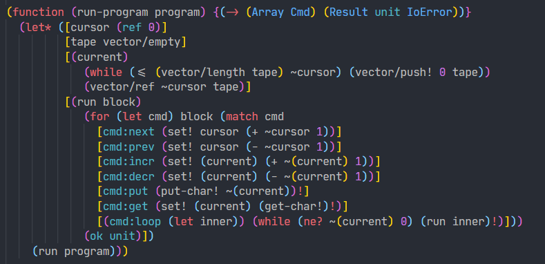

# llrl: Lisp-like programming language powered by Rust + LLVM

llrl is an experimental/toy **L**isp-**l**ike programming language powered by **R**ust and **L**LVM.

<p align="center">

</p>

- [Implementation notes (Japanese)](https://scrapbox.io/yubrot/llrl_programming_language)
- [Language design choices (Japanese)](https://scrapbox.io/yubrot/llrl%E3%81%AE%E8%A8%80%E8%AA%9E%E3%83%87%E3%82%B6%E3%82%A4%E3%83%B3%E4%B8%8A%E3%81%AE%E9%81%B8%E6%8A%9E)

## Features

llrl is mainly influenced by OCaml, Rust, Haskell, Scala, and Scheme.

- **Statically-typed**
  - Hindley-Milner based type system
  - Supports type classes
- **Lisp-like syntax + macros**
  - Uses S-expressions to write programs
  - Macros are compiled and executed by LLVM JIT
- Modules
- Closures
- Algebraic data types
- Pattern matching
- ...

## Goals and Non-goals

llrl was originally started by learning [LLVM Kaleidoscope Tutorial](https://llvm.org/docs/tutorial/index.html) in Rust. This tutorial is great for learning LLVM frontend basics, but as [the tutorial conclusion suggests](https://llvm.org/docs/tutorial/OCamlLangImpl8.html), there are a lot of things to do to make our compiler more practical.

The goal of llrl is not to create a modern, practical programming language. Instead, llrl focuses to make a compiler [self-hosted](<https://en.wikipedia.org/wiki/Self-hosting_(compilers)>). To achieve this with [LLVM-C API](https://llvm.org/doxygen/group__LLVMC.html), we need to implement more language features like strings, pointers, etc. On the other hand, Implementing self-hosting compiler does not require a rich runtime system including garbage collections, exception handling, etc.

### Roadmap

- [x] Language Design
- [x] llrl0: llrl compiler by Rust
  - [x] S-expression parser
  - [x] Syntax analysis
  - [x] Loading mechanism for a set of source codes
  - [x] Semantic analysis
    - [x] Import/export resolution
    - [x] Design and construction of ASTs
    - [x] Name resolution
    - [x] Kind and type inference and unification algorithm
    - [x] Pattern matching analysis
  - [x] Code generation
    - [x] Monomorphization
    - [x] Closure conversion
    - [x] Pattern matching expansion
    - [x] A very simple heap2stack
    - [x] LLVM backend
    - [x] Macro expansion
  - [x] Driver
- [ ] llstd: llrl standard library
  - [x] Macro helpers (`gensym`, `quasiquote`, `s/match`)
  - [x] S-expression
  - [x] Common macros (`let*`, `let1`, ...)
  - [x] Common type classes (`Default`, `Eq`, `Ord`, `Hash`, `Display`, `Cast`, ...)
  - [x] Common data types (`Bool`, Integers, Floating-point numbers, `Ptr`, `Option`, `Result`, `Char`, `String`, Tuples, ...)
  - [ ] Aggregate data types
    - [x] Array
    - [x] Vector
    - [x] Ordered map (B-tree)
    - [ ] Ordered set
    - [x] Hash map
    - [ ] Hash set
    - [x] Persistent ordered map (Red-black tree)
    - [ ] Persistent ordered set
    - [ ] Persistent hash map (HAMT)
    - [ ] Persistent hash set
    - [ ] Persistent sequence (rrb-vector)
  - [x] Arithmetic operations
  - [x] Bit operations
  - [x] [xxHash](https://github.com/Cyan4973/xxHash)
  - [x] Iterators
  - [ ] Derive macro
  - [ ] System
    - [x] I/O
    - [x] Path
    - [x] File
    - [ ] Directory
    - [ ] Command line arguments
    - [ ] Process
- [ ] llrl1: llrl compiler by llrl
  - [ ] LLVM-C API porting
  - [ ] S-expression parser
  - [ ] Syntax analysis
  - [ ] Loading mechanism for a set of source codes
  - [ ] Semantic analysis
  - [ ] Code generation
  - [ ] Driver

## Usage

Since `llrl0` is an executable that runs standalone, you can simply run it with `cargo run` or `cargo build`.

```shell
cargo build --release
./target/release/llrl0 --help
./target/release/llrl0 -O examples/fibonacci-numbers

# or

cargo run -- -O examples/fibonacci-numbers
```

### Requirements

- Linux x64
  - llrl does not take into account support for other platforms
- glibc
  - Not tested other C libraries but llrl depends a few implementation-details of glibc (plase see [rt/rt.c](./rt/rt.c))
- clang
- LLVM 11.0
  - I use [llvmenv](https://github.com/llvmenv/llvmenv) for building LLVM
- Boehm GC 8.0
  - On Arch Linux, you can install Boehm GC by simply running `pacman -S gc`

### Editor support

VSCode language support is available at [yubrot/llrl-vscode](https://github.com/yubrot/llrl-vscode).

## Language Overview

### Packages and Modules

Modules are identified by a string in the form of a path separated by a slash `/`.
The first part of the path points to the name of the package, and the rest of the parts correspond to the file path on the package. If the file path on the package is omitted, it is treated as equivalent to `<package-name>/prelude`.

There are several predefined package names:

- `~`: The special pakcage name that refers to the current package.
- `builtin`: a set of language built-in definitions used directly by numeric literals, etc.
- `std`: the llrl language standard library. `std/prelude` is implicitly imported in all modules (this behavior can be disabled with `(no-implicit-std)` declaration)

```llrl
(import "std/hash-map" HashMap)

; Import all matching definitions by using `_` as a prefix or postfix
(import "std/hash-map" HashMap hash-map/_)

; Import everything
(import "std/hash-map" _)

; Export works as well
(export HashMap)
```

### Functions

```llrl
(function pi
  3.1415)

(function (square x)
  (* x x))

(function (squared-length a b)
  (+ (* a a) (* b b)))

pi                   ; => 3.1415
(square 10)          ; => 100
(squared-length 3 4) ; => 25

; With type signatures
(function pi {F64}
  3.1415)

(function (square x) {(-> I32 I32)}
  (* x x))

; Generalization
(function (identity x) {(forall A) (-> A A)}
  x)

; Generalization with constraints
(function (generic-square x) {(forall A) (-> A A) (where (Mul A))}
  (* x x))
```

### Types

Primitive types are defined in [builtin.llrl](./llrl0/src/ast/builtin.llrl#L61-L81).

```llrl
unit      ; Synonym for empty tuple (:)
Bool
I8
I16
I32
I64
U8
U16
U32
U64
F32
F64
String
Char

; Tuples
(: I32 I32)
(: String Char I32)

; Functions
(-> I32)
(-> I32 I32 I32)

; Option/Result
(Option I32)
(Result (Option I32) String)
```

### Expressions

llrl does not have a `main` function, and the expressions written at the top level are executed in order.

```llrl
; Literals
123
3.14
"Hello, World!\n"
#\a
#t
#f

; Function/macro application
(sqrt 2)
(+ 12 (* 34 56) 78)

; Conditional branching
(if #f
  (println! "then")
  (println! "else))

; Sequencing
(begin
  (println! "a")
  (println! "b")
  (println! "c"))

; Local variable binding
(let ([a 12]
      [b 34])
  (+ a b))

; Local function binding
(let ([(square x) (* x x)])
  (square 3))

; Loop
(let1 i (ref 0)
  (while (< ~i 5)
    (println! "Hello")
    (set! i (+ ~i 1))))

; Tuple creation
(: 12 "hello" #\x)

; Early return
(when (< x y) (return))
```

[`std/control`](./std/control.llrl) contains general purpose macros that may be frequently used in expressions.

### Data types

```llrl
(data Answer
  answer:yes
  answer:no)

; Construction
answer:yes
answer:no

; Deconstruction
(match ans
  [answer:yes "yes"]
  [answer:no "no"])

; Constructors can have fields
(data Vec2
  (vec2: F32 F32))

(function (vec2/new x y)
  (vec2: x y))

(function (vec2/squared-length vec) {(-> Vec2 F32)}
  (match vec
    [(vec2: (let x) (let y))
      (+ (* x x) (* y y))]))

; Data types can be parameterized
(data (MyOption A)
  myopt:none
  (myopt:some A))

(function (myopt/or a b) ; inferred as {(forall A) (-> (MyOption A) (MyOption A) (MyOption A))}
  (match a
    [(myopt:some (let x))
      (myopt:some x)]
    [myopt:none
      b]))
```

`builtin` contains [`Option`](./llrl0/src/ast/builtin.llrl#L86-L89) and [`Result`](./llrl0/src/ast/builtin.llrl#L91-L94) declaration. These types are re-exported by [`std/option`](./std/option.llrl) and [`std/result`](./std/result.llrl) with utility functions and common type class instances.

### Type classes

llrl type classes are almost same as Haskell 2010 type classes + `MultiParamTypeClasses` + `FlexibleContexts` `FlexibleInstances` + `UndecidableInstances`. Orphan checks, fundeps, and associated types are not implemented.

```llrl
(class (Semigroup A)
  (function (<> x y) {(-> A A A)}))
```

Each class instance has its own name. Instances are automatically resolved when using methods of the class, but the instances that are resolved must exist in the current scope by import/export.

```llrl
(instance Semigroup.I32 (Semigroup I32)
  (function (<> x y)
    (+ x y)))

(instance Semigroup.String (Semigroup String)
  (function (<> x y)
    (string x y)))

(println! (<> 12 34))
(println! (<> "foo" "bar"))
```

`std` provides several type classes that express frequently appearing operations like [`Eq`](./std/eq.llrl), [`Ord`](./std/ord.llrl), [`Display`](./std/display.llrl), etc.

### Macros

The definition of macros have the same form as functions, but the types of macros are always `(-> (Syntax Sexp) (Result (Syntax Sexp) String))`. [`(Syntax A)`](./llrl0/src/ast/builtin.llrl#L114-L116) is the internal representation type used for embedding context information, and [`Sexp`](./llrl0/src/ast/builtin.llrl#L118-L128) is the structure of S-expressions itself. This means that macros take the S-expression of the macro application (with context information) as an argument and either return the result of the macro expansion or return an expansion error. Since it is hard to deconstruct and construct S-expressions manually, there is `s/match` to deconstruct S-expressions and quoting to construct S-expressions.

For example, `lambda` syntax is defined as a macro in [std/boot/5-lambda](./std/boot/5-lambda.llrl):

```llrl
; Example use: (lambda (x y) (+ x y))
(macro (lambda s)
  (s/match s                                ; Matching with (lambda (x y) (+ x y))
    [(_ ,args ,@body)                       ; args := (x y), body := ((+ x y))
      (ok
        (let ([tmp-f (gensym)])             ; Generate a non-overlapping symbol
          `(let ([(,tmp-f ,@args) ,@body])  ; Construct a S-expression:
            ,tmp-f)))]                      ; (let ([(<tmp-f> x y) (+ x y)]) <tmp-f>)
    [_
      (err "Expected (lambda (arg ...) body ...)")]))
```

`s/match` and `quasiquote` are defined as macros in [std/boot/2-s-match](./std/boot/2-s-match.llrl), [std/boot/3-quasiquote](./std/boot/3-quasiquote.llrl).

`'`(quote), `` ` `` (quasiquote), `,` (unquote), `,@` (unquote-splicing) are the same as in the classical Lisp, but there is a llrl-specific quoting, `\` (capture). This captures the "use" of the definition in the scope.
For example, `and` macro (defined in [std/bool](./std/bool.llrl)) uses the function `&&` in the result of the macro expansion. Thanks to the capture, this points to the intended `&&` even if `&&` does not exist in the scope of the macro caller.

```llrl
(macro (and s)
  (s/match s
    [(_)
      (ok '#t)]
    [(_ ,a ,@bs)
      (s/foldr (lambda (a b) `(,\&& ,a ,b)) a bs)]
    [_
      (err "Expected (and cond ...)")]))
```

To simplify the compilation and the JIT execution order, macros are not usable in the defined module.

### Standard library

Many functionalities are implemented and provided in the standard library.

TODO: std overview?
