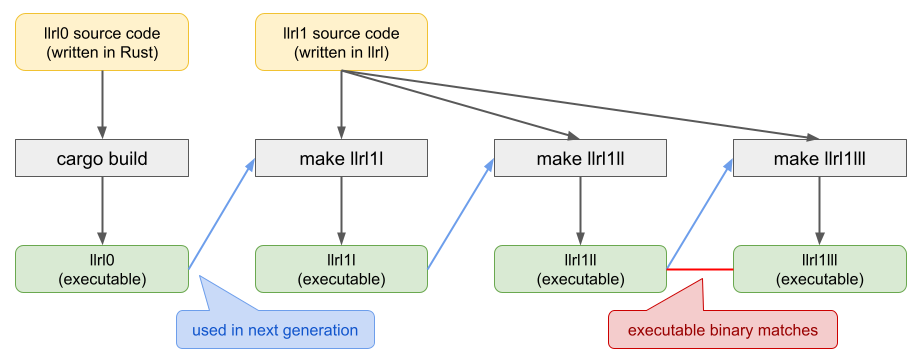

# llrl1

llrl compiler implementation written in llrl.

```shell
make self-hosting
```

## Diagram



Note that `llrl1` does not match its binary with `llrl2`, since `llrl0` (used to produce `llrl1`) is implemented in a way that does not always output the same result. This is due to parallelization, hash value computation, etc.
